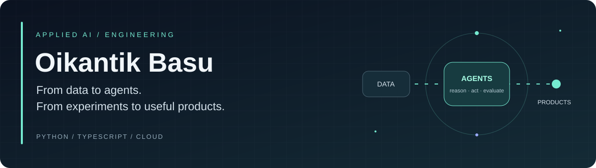
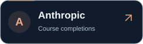
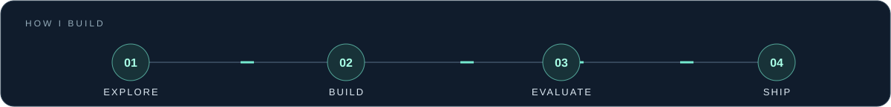
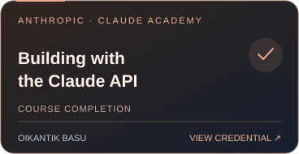
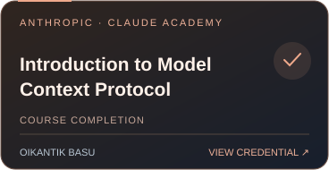
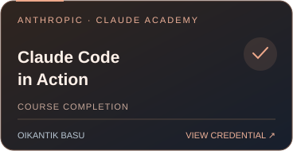
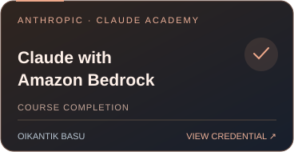
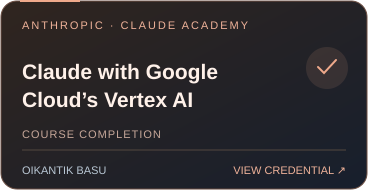
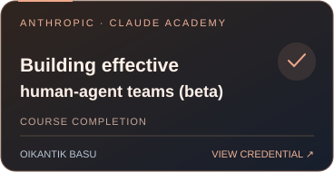
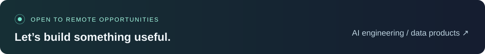

  

<h1 align="center">Hi, I'm Oikantik Basu.</h1>

<strong>Generative AI Engineer · Agent Systems · Data Science</strong> 
Bengaluru, India · IST (UTC+5:30) · Open to remote opportunities

  <a href="https://basuoikantik.in/"><strong>Portfolio</strong></a> &nbsp; / &nbsp;
  <a href="https://www.linkedin.com/in/oikantik-basu-b13919278/"><strong>LinkedIn</strong></a> &nbsp; / &nbsp;
  <a href="https://www.kaggle.com/oikantikbasu007"><strong>Kaggle</strong></a> &nbsp; / &nbsp;
  <a href="mailto:basuoikantik@gmail.com"><strong>Email me</strong></a>

  
  
  
  

I build LLM applications, multi-agent workflows and data products with **Python, TypeScript and cloud services**. My work spans retrieval-augmented generation, model evaluation, voice interfaces and the software around them: APIs, state, observability and usable frontends.

I'm interested in **remote Generative AI Engineer, Applied AI Engineer and AI-focused Python Developer roles**, as well as data science opportunities where models become useful products.

### A few things about me

- **Remote experience:** Freelance AI Agent Specialist at **Mindrift**, working on RLHF evaluations and Python code-generation assessment.
- **Education:** Pursuing the **online Master's in Data Science at the University of Pittsburgh**, expected February 2027. B.Tech in Computer Science & Engineering, Techno International New Town, 2024.
- **Hackathons:** My team’s **VyaparGyan** project was a **Top 36 finalist at AI for Bharat**, powered by AWS with Hack2skill. [Background and achievements →](https://basuoikantik.in/#experience)
- **Experiments:** Published a [Kaggle writeup on fine-tuning Gemma 3 for verifiable reasoning](https://www.kaggle.com/competitions/google-tunix-hackathon/writeups/new-writeup-1767949274949).

### Selected work

A selection of my independent projects, capstone work and team hackathon builds.

| Project | What I built / contributed to | Engineering focus |
| :--- | :--- | :--- |
| **[Cred Domain Support Agent](https://github.com/Golden007-prog/cred-loan-support-agent)** | A lending-support capstone that retrieves cited policy answers, checks synthetic loan records and routes escalation recommendations. | **Python · LangGraph · Chroma · FastAPI** — input/output guards, checkpointing, evaluation and an offline mock mode. |
| **[VyaparGyan](https://github.com/Golden007-prog/Vyapar-Gyan)** | A team retail platform combining conversational commerce, multilingual voice workflows and AI-assisted inventory operations. | **TypeScript · Next.js · AWS Lambda · DynamoDB · Bedrock** — event-driven workflows, role-based access and infrastructure as code. |
| **[Omni-Lab](https://github.com/Golden007-prog/Omni-Lab)** | A multimodal learning workspace with document-to-slide generation, live voice tutoring, flashcards and quizzes. | **React · TypeScript · Gemini** — voice interruptions, structured model output and synchronized UI state. [Project story →](https://devpost.com/software/omni-lab) |
| **[Bruhworking / NexusFlow](https://github.com/Golden007-prog/bruhworking)** | A document workflow with planner, researcher, writer and reviewer agents. | **Python · FastAPI · Google ADK · Cloud Run** — SSE progress streaming, revision loops and per-agent usage tracking. |
| **[Netflix Content Analytics](https://github.com/Golden007-prog/Netflix-Data-Cleaning-Analysis-and-Visualization)** | A reproducible catalog-analysis pipeline from ingestion and cleaning to exploration, modeling and a dashboard. | **Python · PostgreSQL · Pandas · Streamlit** — data preparation, statistical analysis and interactive communication. |

**More data science:** [Employee attrition](https://github.com/Golden007-prog/IBM-HR-Analytics-Employee-Attrition-Performance) · [Stock forecasting](https://github.com/Golden007-prog/TCS-Stock-Data-Live-and-Latest) · [Drug side-effect analysis](https://github.com/Golden007-prog/Drugs-Side-Effects-and-Medical-Condition)

### Tools I work with

| Area | Tools and methods |
| :--- | :--- |
| **AI & agents** | LangGraph, LangChain, Google ADK, Gemini, RAG, Chroma, LLM evaluation |
| **Data & ML** | Python, SQL, Pandas, scikit-learn, exploratory analysis, feature engineering |
| **Applications** | FastAPI, TypeScript, React, Next.js, Streamlit |
| **Cloud & delivery** | AWS, Google Cloud, Cloud Run, Docker, Git, GitHub Actions |

<!-- BADGE-GALLERY -->

### Badges & credentials

#### Credly credentials

  
  
  
  

[Google AI Professional Certificate](https://www.credly.com/badges/478e4f51-08e7-4e7a-858c-39cd6b383b63) · [Python for Data Science and AI](https://www.credly.com/badges/605e07ea-1781-43ca-a2e2-4882305e3367) · [Data Science Methodology](https://www.credly.com/badges/5a23351b-b54e-491d-b0df-64a43a79db14) · [Tools for Data Science V2](https://www.credly.com/badges/464a1ef3-139a-4104-bd80-1df6a5b79be4)

Issued by **Coursera**; the three data science badges are authorized by **IBM**. [View my public Credly wallet →](https://www.credly.com/users/oikantik-basu/badges/credly)

#### Anthropic course completions

Selected **Claude Academy** course-completion badges. Each card opens its official verification page.

  
  
  
  
  
  

All 20 Anthropic course-completion links

- [AI Fluency for pK–12 educators](https://academy.claude.com/verify/23916d20fc67033d3220c0f2ce766431)
- [AI Fluency for nonprofits](https://academy.claude.com/verify/ca3ae6a8b27c9c489039095d9a2f5d67)
- [AI Fluency for small businesses](https://academy.claude.com/verify/8b4b31a870cce72cb8c10f5c9515aa2c)
- [AI Fluency for students](https://academy.claude.com/verify/771d4ca41ccd23165efb14d18173ec65)
- [Building effective human-agent teams (beta)](https://academy.claude.com/verify/183c0f292eb063c697eee882a0ad6902)
- [Building with the Claude API](https://academy.claude.com/verify/ce9d252a04b863ef2620e1e42715754d)
- [AI Fluency: Framework & Foundations](https://academy.claude.com/verify/4f5428a8727689094ae63dfbdd5cd405)
- [AI Fluency for educators](https://academy.claude.com/verify/7e717e7755534183fcac7f829b63676c)
- [AI Capabilities and Limitations](https://academy.claude.com/verify/861eb574e081153ff9c93dcc8f0e8d6a)
- [AI Fluency for Creative Work](https://academy.claude.com/verify/467a139ef2cf74a95e9c77b38d7844db)
- [AI Fluency for Builders](https://academy.claude.com/verify/590c9d3c714d34731cd49450800acd73)
- [Claude with Amazon Bedrock](https://academy.claude.com/verify/bc8daa6f2342e67c6281222d9855ef5c)
- [Claude with Google Cloud's Vertex AI](https://academy.claude.com/verify/d4560cab47cd46d1b3be35844a71e470)
- [Claude Code in Action](https://academy.claude.com/verify/ebc67c8096736e3ba1c8150b6b69d2bc)
- [Deploying Claude Enterprise with Confidence: The five decisions that shape your rollout](https://academy.claude.com/verify/a1c10e2d2ccdbe9b84c651f482810a7b)
- [Claude Platform 101](https://academy.claude.com/verify/a744ac3dd38ce898129535384c15640e)
- [Introduction to Model Context Protocol](https://academy.claude.com/verify/7473c81277f3424f45fd6c7c12b6dfbe)
- [Claude Code 101](https://academy.claude.com/verify/7d50858c00db41b4a131190f16e836a1)
- [Introduction to Claude Cowork](https://academy.claude.com/verify/0a254b765410d4a1c40a9dca7177355a)
- [Claude 101](https://academy.claude.com/verify/132f28b34b597982e46b3c31d09d1ab0)

#### Kaggle badges

Highlights from the **20 badges** on my [Kaggle profile](https://www.kaggle.com/oikantikbasu007), checked October 9, 2026.

<table>
<tr><td align="center" width="25%"><a href="https://www.kaggle.com/oikantikbasu007"> 5-Day AI Agents Intensive Course with Google</a></td><td align="center" width="25%"><a href="https://www.kaggle.com/oikantikbasu007"> Research Competitor</a></td><td align="center" width="25%"><a href="https://www.kaggle.com/oikantikbasu007"> Code Submitter</a></td><td align="center" width="25%"><a href="https://www.kaggle.com/oikantikbasu007"> Competitor</a></td></tr>
<tr><td align="center" width="25%"><a href="https://www.kaggle.com/oikantikbasu007"> Python Coder</a></td><td align="center" width="25%"><a href="https://www.kaggle.com/oikantikbasu007"> Dataset Creator</a></td><td align="center" width="25%"><a href="https://www.kaggle.com/oikantikbasu007"> API Notebook Creator</a></td><td align="center" width="25%"><a href="https://www.kaggle.com/oikantikbasu007"> API Dataset Creator</a></td></tr>
</table>

See all 20 earned Kaggle badges

- 5-Day AI Agents Intensive Course with Google
- Research Competitor
- Code Submitter
- Competitor
- Code Tagger
- Vampire
- API Dataset Creator
- API Notebook Creator
- Colab Coder
- Code Forker
- 1 Year on Kaggle
- Dataset Creator
- Competition Modeler
- March Mania Competitor
- Notebook Modeler
- Code Uploader
- Python Coder
- Kaggle Community Member
- 7 Day Login Streak
- Agent of Discord

[View badges on Kaggle →](https://www.kaggle.com/oikantikbasu007)

<!-- /BADGE-GALLERY -->

### Learning in public

On [Kaggle](https://www.kaggle.com/oikantikbasu007), I explore model training and applied ML. My **Gemma 3 reasoning project** investigates fine-tuning with **Tunix / JAX and GRPO**, with a public writeup and project notebooks. [Read the experiment →](https://www.kaggle.com/competitions/google-tunix-hackathon/writeups/new-writeup-1767949274949)

On my [portfolio](https://basuoikantik.in/), you can find project context, experience, education and credential links.

### Let's build something useful

**Hiring for a remote AI or data role?** I'd love to discuss your product, the engineering challenges and where I can contribute.

[**Email basuoikantik@gmail.com →**](mailto:basuoikantik@gmail.com) &nbsp; · &nbsp; [Connect on LinkedIn](https://www.linkedin.com/in/oikantik-basu-b13919278/) &nbsp; · &nbsp; [Explore my portfolio](https://basuoikantik.in/)

